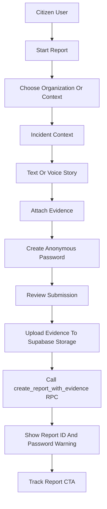
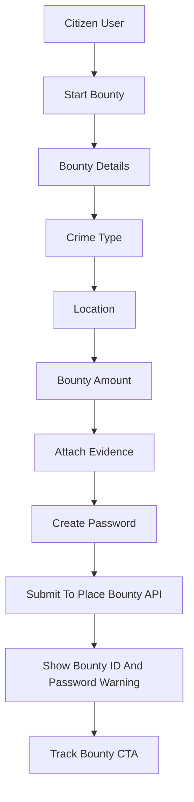
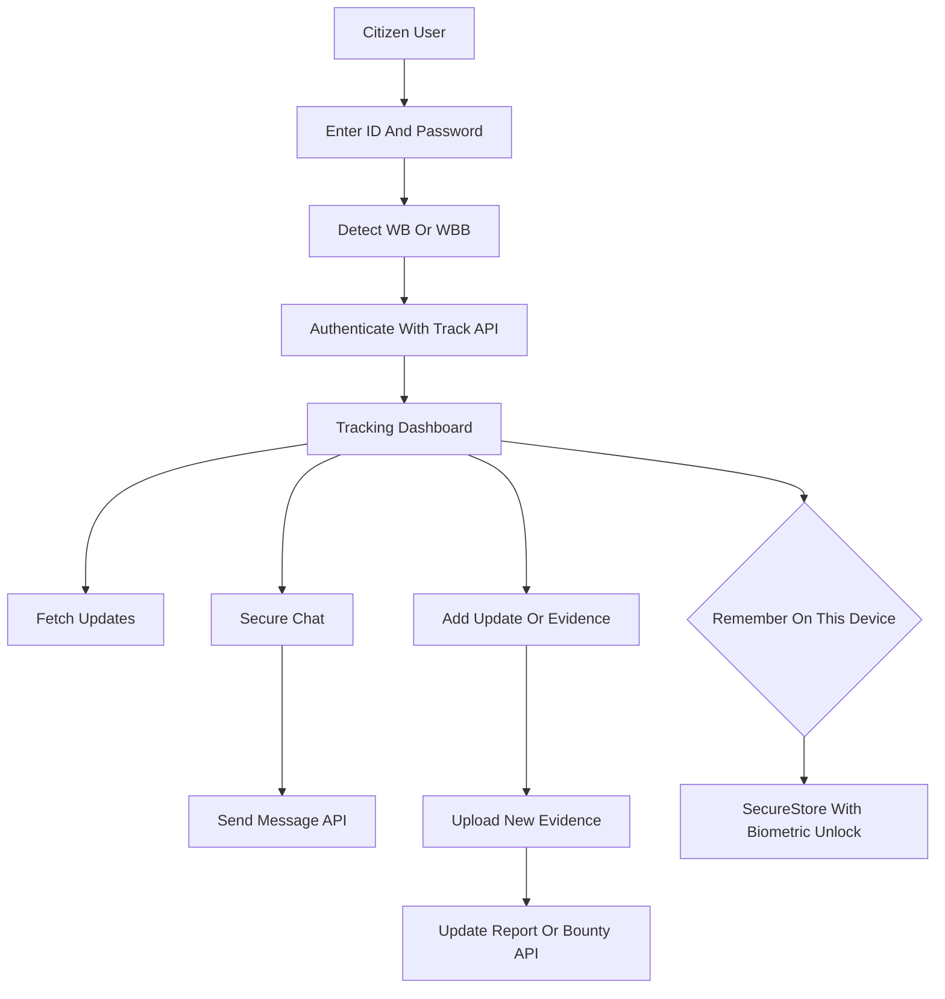

# WhistleBlower Native Mobile App Implementation Plan

## 1. Purpose

This document defines the implementation plan for a citizen-facing native mobile app for WhistleBlower. It is intended as a handoff brief for the agent or team building the app.

The mobile app should bring the most important WhistleBlower web features to iOS and Android with a secure, anonymous, fast, and trustworthy mobile experience.

The first release should focus on citizens, reporters, bounty placers, and people submitting tips. Admin operations, billing management, organization onboarding, and content editing should remain web-first until the citizen app is stable.

## 2. Current Web App References

The mobile app should reuse the current product model and backend contracts where possible.

Important existing files:

- Report wizard: `src/views/SubmitReportPage.jsx`
- Report wizard step definitions: `src/components/submit-report/submitReportStepMeta.js`
- Report RPC argument builder: `src/lib/submitReportRpc.js`
- Bounty wizard: `src/views/PlaceBountyPage.jsx`
- Tracking entry screen: `src/views/TrackPage.jsx`
- Report tracking screen: `src/views/TrackReportPage.jsx`
- Bounty tracking screen: `src/views/TrackBountyPage.jsx`
- Tracking API wrapper: `src/lib/trackApi.js`
- Chat component: `src/components/Chat.jsx`
- Storage upload helper: `src/lib/supabaseStorageService.js`
- Analytics exclusions: `src/lib/analytics.js`
- News list: `src/views/NewsPage.jsx`
- News detail: `src/views/NewsPostPage.jsx`
- Bounty detail: `src/views/BountyPostPage.jsx`
- Nigerian states and LGAs: `src/data/nigerianStatesAndLgas.json`

## 3. Product Goals

The app should help users:

- Submit anonymous reports quickly and safely.
- Add photos, videos, documents, or voice notes as evidence.
- Place public bounties for information.
- Track submitted reports and bounties using an ID and password.
- Chat securely with administrators after submitting.
- Browse latest news, bounty posts, and most-wanted alerts.
- Submit tips from bounty or most-wanted content.
- Understand how WhistleBlower protects their data.

Success means a first-time user can open the app, understand the service, submit or track a report without training, and feel confident that their identity is protected.

## 4. MVP Scope

### Included In MVP

- Home screen
- Anonymous report submission
- Bounty placement
- Report and bounty tracking
- Secure chat and updates
- Evidence upload
- News feed
- Bounty listings
- Most-wanted listings
- News, bounty, and most-wanted detail screens
- Contact/support form
- FAQ
- About
- Rewards explainer
- Security/privacy explainer
- Privacy policy
- Terms of service
- Disclaimer
- Optional secure saving of tracking credentials with biometric or device unlock

### Excluded From MVP

- Admin dashboard
- Organization registration
- Organization login
- Billing management
- Payment management
- News/content editor
- Most-wanted editor
- User and role management
- Audit logs
- Image converter
- Web-only experimental pages

### Planned For Phase Two

- Privacy-safe push notifications
- Biometric app lock refinements
- Offline draft reports
- Deeper realtime chat
- Organization account flows
- Lightweight mobile admin review tools, if there is a confirmed operational need

## 5. Recommended Mobile Stack

Use Expo React Native with TypeScript.

Recommended libraries:

- Expo Router for navigation
- Supabase JS for backend integration
- TanStack Query for remote state, caching, retries, and invalidation
- React Hook Form for forms
- Zod for validation schemas
- Zustand for lightweight app state
- Expo SecureStore for sensitive local persistence
- Expo LocalAuthentication for biometric/device unlock
- Expo ImagePicker for camera and gallery evidence
- Expo DocumentPicker for document evidence
- Expo AV or a maintained native audio recorder for voice notes
- Expo FileSystem for temporary file handling
- Expo Sharing for receipt/share flows
- Sentry for crash reporting with privacy scrubbing
- EAS Build and Submit for release builds

Avoid adding a heavy global state framework unless the app grows beyond the MVP flows. Most server state should live in TanStack Query, and most local state should stay inside feature modules.

## 6. Navigation Model

Use a bottom-tab app structure with stack screens under each tab.

Primary tabs:

- Home
- Report
- Track
- News
- More

Suggested route map:

```txt
app/
  (tabs)/
    home/
      index.tsx
    report/
      index.tsx
    track/
      index.tsx
    news/
      index.tsx
    more/
      index.tsx
  report/
    submit.tsx
    success.tsx
  bounty/
    place.tsx
    success.tsx
    [slug].tsx
  track/
    report.tsx
    bounty.tsx
  news/
    [slug].tsx
  most-wanted/
    index.tsx
    [slug].tsx
  legal/
    privacy-policy.tsx
    terms-of-service.tsx
    disclaimer.tsx
```

## 7. Screen Map

### Home

Purpose: Build trust and direct users to the most important actions.

Required sections:

- Short hero message
- Primary CTA: Submit Report
- Secondary CTA: Track Submission
- Quick actions for Place Bounty and Browse Most Wanted
- Security/trust summary
- Latest news preview
- How it works summary

### Report Tab

Purpose: Start report-related actions.

Required actions:

- Submit a new report
- Submit a bounty tip
- Submit a most-wanted sighting
- Learn how anonymous reporting works

### Submit Report Wizard

Model the active web report wizard from `src/views/SubmitReportPage.jsx` and `src/components/submit-report/submitReportStepMeta.js`.

Standard report steps:

1. Organization
2. Incident context
3. Story
4. Evidence
5. Review and submit

Supported report modes:

- Standard anonymous report
- Customer feedback, if kept for mobile content flows
- Bounty tip
- Most-wanted sighting
- Organization-locked report link, if opened from a deep link

Important behavior:

- Generate a public report ID with a `WB` prefix.
- Hash the anonymous password before calling the backend, matching the current `hash:salt` pattern.
- Upload voice notes and evidence before calling the report RPC.
- Call the existing `create_report_with_evidence` RPC with the same argument shape produced by `src/lib/submitReportRpc.js`.
- Link bounty tips and most-wanted sightings to their source content when applicable.
- Show a success screen with the report ID, password warning, and tracking CTA.

### Place Bounty Wizard

Model the current web bounty flow from `src/views/PlaceBountyPage.jsx`.

Required steps:

1. Bounty title and description
2. Crime type
3. Location
4. Bounty amount
5. Evidence
6. Password
7. Review and submit

Important behavior:

- Generate a public bounty ID with a `WBB` prefix.
- Hash the password before submission.
- Submit through the existing place-bounty API exposed through `createTrackedBounty` in `src/lib/trackApi.js`.
- Show a success screen with the bounty ID, password warning, and tracking CTA.

Mobile recommendation:

- Standardize bounty evidence upload on Supabase storage or a dedicated upload API. The current web bounty flow still uses a local upload helper in some places; the mobile app should avoid local/static upload paths.

### Track

Model the current tracking behavior from `src/views/TrackPage.jsx`, `src/views/TrackReportPage.jsx`, and `src/views/TrackBountyPage.jsx`.

User input:

- Report or bounty ID
- Password

Routing rule:

- IDs starting with `WBB` are bounties.
- Other `WB` IDs are reports.

After authentication, users should see:

- Submission summary
- Status
- Evidence list, where allowed
- Admin updates
- Secure chat
- Add update/evidence action
- Reward/paycode section when available
- Logout/forget action

Important mobile difference:

- Do not use `sessionStorage`. The web app currently stores tracking credentials in `sessionStorage`; mobile must use an explicit secure-storage flow.

### Secure Chat

Model the behavior from `src/components/Chat.jsx`.

Required capabilities:

- Message list
- Admin/user distinction
- Reply-to-message support
- Send message
- New message indicator
- Connection/live state
- Mark messages as read
- Pull-to-refresh
- Polling-based updates for MVP

Phase two can replace or augment polling with push notifications and deeper realtime behavior.

### News

Required content:

- Latest news
- Bounty posts
- Most-wanted posts
- Category filters
- State/LGA filters
- Detail screens
- Share action
- CTA to submit a related tip

The mobile app should reuse the same Supabase-backed news model and Nigerian location data used by the web app.

### More

Required screens:

- About
- How we secure your data
- Rewards for information
- Partner program
- FAQ
- Contact
- Privacy policy
- Terms of service
- Disclaimer

## 8. Core User Flows

### Report Submission Flow



### Bounty Placement Flow



### Tracking And Chat Flow



## 9. Backend Integration

The mobile app should reuse existing backend behavior where possible. Sensitive verification logic should stay server-side.

### Supabase

Use Supabase for:

- Database reads
- Storage upload
- Auth, when later organization/user flows are introduced
- RPC calls
- Realtime or polling support where appropriate

### Report Creation

Mobile should:

- Generate or receive a `WB` report ID.
- Hash the password using the same algorithm expected by the backend.
- Upload evidence to the private evidence bucket.
- Build RPC args equivalent to `buildCreateReportRpcParams`.
- Call `create_report_with_evidence`.

The mobile implementation should preserve these fields:

- Report ID
- Organization ID or organization name
- Title
- Description
- Category
- State
- LGA
- Incident address
- Incident date
- Anonymous flag
- Anonymous password hash
- Evidence paths
- Report type
- Voice-note flag
- Feedback flag, if supported

### Bounty Creation

Mobile should submit through the same server API currently used by `createTrackedBounty`.

Expected payload:

- Bounty ID
- Title
- Description
- Type of crime
- State
- LGA/location
- Full address
- Incident date
- Bounty amount
- Password hash
- Evidence paths

### Tracking APIs

Reuse the existing API contract represented by `src/lib/trackApi.js`:

- `POST /api/track/report`
- `POST /api/track/report/updates`
- `POST /api/track/report/message`
- `POST /api/track/report/update`
- `POST /api/track/bounty`
- `POST /api/track/bounty/updates`
- `POST /api/track/bounty/message`
- `POST /api/track/bounty/update`
- `POST /api/place-bounty`

Mobile should call these APIs over HTTPS using a configured API base URL. Do not duplicate server-side tracking password verification in the app.

### Contact

Use the existing contact email edge function or expose a small mobile-safe API wrapper around it.

### Content

Use Supabase reads or existing server endpoints for:

- Published news
- Bounty posts
- Most-wanted posts
- Detail pages
- Location filters

Prefer a typed content service in the mobile app so screens do not directly scatter Supabase queries.

## 10. Evidence And Media Handling

Supported evidence types:

- Photos
- Videos
- Documents
- Audio files
- Voice notes recorded in-app

Requirements:

- Show file name, size, and type before upload.
- Enforce size and type limits before upload.
- Show upload progress.
- Support retry for failed uploads.
- Clear temporary local files after upload.
- Avoid storing evidence content in persistent local storage.
- Avoid exposing private evidence paths as public URLs.

Recommended file limits for MVP:

- Images: 10 MB each
- Documents: 20 MB each
- Videos: 100 MB each, subject to backend acceptance
- Audio: 25 MB each
- Maximum files per submission: 10

The final limits must match backend and Supabase storage policies before release.

## 11. Credential Storage And Biometrics

The MVP should support optional secure saving of tracking credentials.

Default behavior:

- Users enter report/bounty ID and password manually.
- After successful authentication, the app asks whether to remember this submission on the device.
- If the user declines, credentials remain in memory only for the active app session.

If the user accepts:

- Store credentials using Expo SecureStore.
- Protect access with Expo LocalAuthentication.
- Require biometric or device passcode unlock before opening a remembered submission.
- Store only the minimum required data:
  - Tracking ID
  - Tracking type: report or bounty
  - Password or future server-issued tracking token, if the backend adds one
  - Display label
  - Last accessed timestamp

Required user controls:

- Forget this report/bounty
- Forget all saved submissions
- Disable biometric unlock for saved submissions
- Clear sensitive session on logout

Security recommendation:

- In a future backend iteration, replace saved plaintext tracking passwords with short-lived or revocable tracking tokens. Until then, SecureStore plus biometric unlock is required for saved credentials.

## 12. Privacy And Security Requirements

Security is a core product requirement, not an enhancement.

Required:

- Use HTTPS only.
- Do not log report descriptions, passwords, evidence paths, private messages, or paycodes.
- Do not send analytics events from sensitive screens.
- Disable analytics on:
  - Submit report
  - Place bounty
  - Track
  - Report tracking
  - Bounty tracking
  - Chat
  - Evidence upload
  - Reward/paycode screens
- Scrub sensitive data from crash reports.
- Store credentials only through SecureStore.
- Protect saved credentials with biometric or device unlock.
- Provide visible password-loss warnings.
- Clear temporary files after upload.
- Avoid sensitive content in notifications.
- Avoid sensitive content in app switcher previews where platform support allows it.
- Add Android screenshot protection on sensitive screens if product/legal approves.

Sensitive screens:

- Report wizard
- Bounty wizard
- Tracking login
- Report dashboard
- Bounty dashboard
- Secure chat
- Evidence preview
- Reward/paycode section

Notification privacy rule:

- Good: `You have a new WhistleBlower update.`
- Bad: `Admin replied to your corruption report about ACME.`

## 13. Analytics And Monitoring

The web app already excludes analytics from sensitive paths in `src/lib/analytics.js`. Mobile should follow the same rule.

Allowed analytics examples:

- App open
- Public content viewed
- News category selected
- Non-sensitive onboarding progress
- Contact form opened

Disallowed analytics examples:

- Report title
- Report category tied to a tracking ID
- Description text
- Evidence metadata
- Password fields
- Chat content
- Paycode/reward content
- Tracking ID

Sentry or any crash monitoring tool must be configured with before-send scrubbing and conservative breadcrumbs.

## 14. Design System Direction

The app should feel calm, secure, modern, and easy to trust.

### Visual Principles

- Strong readability over decorative effects.
- High contrast dark and light themes.
- Simple cards with rounded corners.
- Clear primary actions.
- Muted backgrounds for sensitive flows.
- Minimal animation.
- Progress indicators for multi-step wizards.

### Suggested Theme

- Primary: deep green or trust green
- Background: white and dark navy variants
- Surface: off-white and dark elevated cards
- Text: near-black and near-white
- Warning: amber
- Error: red
- Success: green
- Info: blue

### Typography

- Use platform-native readable type.
- Support dynamic font sizes.
- Avoid small text in forms.
- Use concise headings and helper text.

### Accessibility

Required:

- Minimum 44px touch targets.
- Screen reader labels for buttons and form controls.
- Visible focus states where applicable.
- Error messages near fields.
- No color-only status indicators.
- Support text scaling.
- Test with VoiceOver and TalkBack.

### Empty, Error, And Loading States

Every networked screen should have:

- Loading state
- Empty state
- Error state
- Retry action
- Offline state where relevant

## 15. Proposed Mobile Project Structure

```txt
app/
  (tabs)/
  report/
  bounty/
  track/
  news/
  most-wanted/
  legal/

src/
  components/
    ui/
    forms/
    media/
    feedback/
  features/
    reports/
    bounties/
    tracking/
    chat/
    news/
    contact/
    legal/
  services/
    api/
    supabase/
    storage/
    secureCredentials/
    analytics/
    monitoring/
  hooks/
  theme/
  validation/
  utils/
  types/
  constants/
```

Suggested feature module pattern:

```txt
src/features/reports/
  components/
  screens/
  api.ts
  schema.ts
  types.ts
  utils.ts
```

## 16. Validation Strategy

Use Zod schemas for every user-submitted form.

Validation should cover:

- Required fields
- Password and confirmation match
- Terms confirmation
- File size limits
- File type limits
- Valid state/LGA combinations
- Bounty amount formatting
- Tracking ID format
- Minimum useful message length for chat/update messages

Prefer shared validation concepts from the web app, but implement them in TypeScript-native mobile modules rather than importing web UI code.

## 17. Offline And Connectivity

MVP requirements:

- Detect offline state.
- Prevent final submission while offline.
- Preserve in-progress form state in memory during navigation.
- Show clear retry options for upload/API failures.

Phase two:

- Encrypted offline drafts.
- Background upload retry.
- Resume interrupted evidence uploads.

Offline drafts should not ship until encryption, deletion controls, and data-retention expectations are clear.

## 18. Push Notification Plan

Push notifications should be architected now but shipped in phase two.

Phase two use cases:

- New admin message
- Report status update
- Bounty status update
- Reward/paycode available

Privacy requirements:

- Notifications must be opt-in.
- Notifications must never include report content, bounty content, chat text, evidence names, tracking IDs, or paycodes.
- Users must be able to disable notifications per remembered submission.
- Opening a notification to a sensitive screen must require biometric/device unlock if credentials are saved.

Implementation direction:

- Use Expo Notifications.
- Store device push tokens server-side only after explicit opt-in.
- Associate notification preferences with a server-side tracking identity or future tracking token, not only a raw report ID/password pair.

## 19. Release Phases

### Phase 1: Foundation

- Create Expo app with TypeScript.
- Configure Expo Router.
- Set up theme, UI primitives, and form components.
- Configure Supabase client and API base URL.
- Configure TanStack Query.
- Configure SecureStore and LocalAuthentication wrappers.
- Configure Sentry with sensitive-data scrubbing.
- Add environment handling for development, staging, and production.

Acceptance criteria:

- App runs on iOS and Android simulators.
- Environment switching works.
- Navigation shell is complete.
- Sensitive logging policy is implemented.

### Phase 2: Public Content

- Build Home.
- Build News list/detail.
- Build Bounty and Most Wanted list/detail.
- Build About, FAQ, Contact, and Legal screens.
- Add state/LGA filters.

Acceptance criteria:

- Public content loads from backend.
- Empty/error/loading states exist.
- Users can navigate from content detail to submit a related tip.

### Phase 3: Anonymous Submission

- Build Submit Report wizard.
- Build Place Bounty wizard.
- Implement evidence upload.
- Implement voice note capture.
- Implement success screens.
- Implement password warning and tracking CTA.

Acceptance criteria:

- Users can submit reports successfully.
- Users can place bounties successfully.
- Evidence uploads are reliable.
- Sensitive flows do not emit analytics.

### Phase 4: Tracking And Chat

- Build Track entry screen.
- Build Report tracking dashboard.
- Build Bounty tracking dashboard.
- Build secure chat.
- Build add update/evidence flows.
- Add optional saved submissions with biometric unlock.

Acceptance criteria:

- Users can authenticate with `WB` and `WBB` IDs.
- Users can view updates and statuses.
- Users can send messages.
- Users can add evidence.
- Saved credentials require secure unlock.
- Forget controls clear saved data.

### Phase 5: Hardening And Store Release

- Accessibility pass.
- Performance pass.
- Device QA.
- Security QA.
- App icon and splash screen.
- Store screenshots and metadata.
- EAS production builds.
- App Store and Play Store submission.

Acceptance criteria:

- App passes manual QA on representative iOS and Android devices.
- No known sensitive logging.
- No sensitive analytics on protected flows.
- Crash reporting is scrubbed.
- Store builds are accepted.

### Phase 6: Phase Two Enhancements

- Privacy-safe push notifications.
- Optional encrypted offline drafts.
- Background upload retry.
- Realtime chat improvements.
- Organization account flows, if still needed.
- Lightweight admin workflows, if product approves.

## 20. Testing Plan

### Unit Tests

- Tracking ID detection.
- Validation schemas.
- API payload builders.
- File limit helpers.
- Secure credential service.
- Analytics exclusion rules.

### Integration Tests

- Submit report.
- Place bounty.
- Track report.
- Track bounty.
- Send chat message.
- Add update with evidence.
- Save and forget credentials.

### Manual QA Matrix

Test on:

- Small iPhone
- Large iPhone
- Small Android
- Large Android
- Slow network
- Offline state
- Failed upload
- Wrong password
- Large evidence file
- App background/foreground during tracking
- Biometric unavailable
- Biometric failure
- Device passcode fallback

### Security QA

Verify:

- No sensitive logs.
- No sensitive analytics.
- SecureStore is used for saved credentials.
- Biometric/device unlock gates saved submissions.
- Forget controls remove saved credentials.
- Temporary evidence files are cleared.
- Push notification placeholders contain no sensitive content.
- Crash reports are scrubbed.

## 21. App Store And Play Store Considerations

Prepare:

- App name
- App icon
- Splash screen
- Short and long descriptions
- Privacy policy URL
- Support URL
- Screenshots
- Data safety disclosures
- Age/content rating answers
- Permission usage descriptions

Permissions likely needed:

- Camera
- Photo library
- Microphone
- Files/documents
- Biometrics
- Notifications in phase two

Permission copy must explain the privacy reason plainly. For example:

- Camera: `Attach photo evidence to a report or bounty.`
- Microphone: `Record a voice note report when you choose voice submission.`
- Biometrics: `Protect saved report or bounty tracking access on this device.`

## 22. Handoff Notes For The Development Agent

- Build the mobile app as a new Expo React Native TypeScript app; do not port Next.js UI components directly.
- Reuse backend contracts and product behavior from the web app.
- Treat web `sessionStorage` tracking as a web-only implementation detail; replace it with explicit SecureStore plus biometric unlock.
- Keep sensitive flows out of analytics and crash breadcrumbs.
- Prefer server APIs for tracking authentication and message/update operations.
- Avoid duplicating server-side password verification in the mobile app.
- Standardize mobile evidence uploads on Supabase storage or dedicated server upload endpoints.
- Keep the MVP citizen-focused. Do not add admin, billing, or organization workflows unless the product scope changes.
- Make every sensitive action understandable to non-technical users.
- Add clear warnings that report/bounty passwords cannot be recovered if lost.

## 23. Definition Of Done

The MVP is complete when:

- A user can submit an anonymous report from iOS and Android.
- A user can submit evidence with a report.
- A user can place a bounty.
- A user can track a report or bounty with ID and password.
- A user can securely chat with admins.
- A user can add updates and evidence after submission.
- A user can browse news, bounty, and most-wanted content.
- A user can submit tips from relevant content screens.
- Optional saved credentials are protected by SecureStore and biometric/device unlock.
- Sensitive screens do not send analytics.
- Crash monitoring is scrubbed.
- Accessibility and manual QA are complete.
- The app is ready for App Store and Play Store submission.
